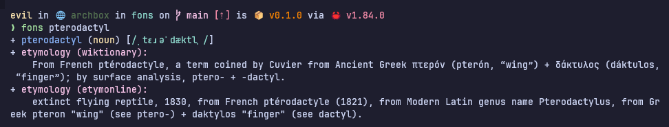

# fons

a command-line etymology dictionary.

### introduction

this command-line etymology dictionary contains etymology definitions of over
one million words collected from [wiktionary](https://www.wiktionary.org/) and
[etymonline](https://www.etymonline.com/).

### usage

+ clone git repo:

```console
git clone https://github.com/samarthkulshrestha/fons.git
cd fons
```

+ `fons` looks for the sqlite database in:
    1. `$FONS_DB` environment variable
    2. `$XDG_DATA_HOME/fons/fons.db`
    3. `~/.local/share/fons/fons.db`

```console
mkdir ~/.local/share/fons/fons.db
cp ./data/fons.db ~/.local/share/fons/
```

+ run:

```console
./bin/fons <searc_term>
```

+ the binary is statically compiled on x86_64 architecture, so you can just copy
  it to a directory in your `$PATH`

```console
cp bin/fons ~/.local/bin/
```

+ now, after restarting your terminal, or running `source ~/.zshrc`, you can:

```console
fons <search_term>
```

### screenshot



### contribute

+ i <3 pull requests and bug reports!
+ don't hesitate to [tell me my code-fu sucks](https://github.com/samarthkulshrestha/fons/issues/new), but please tell me why.

### license

this project is licensed under the MIT License.

Copyright (c) 2025 Samarth Kulshrestha.

